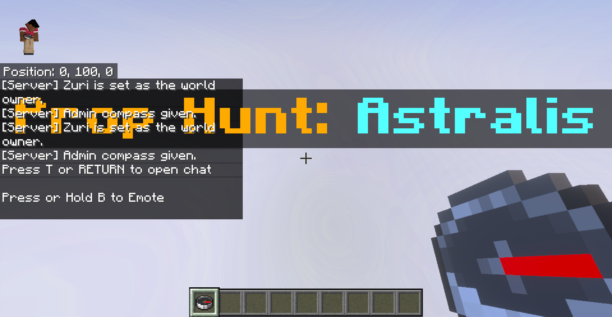
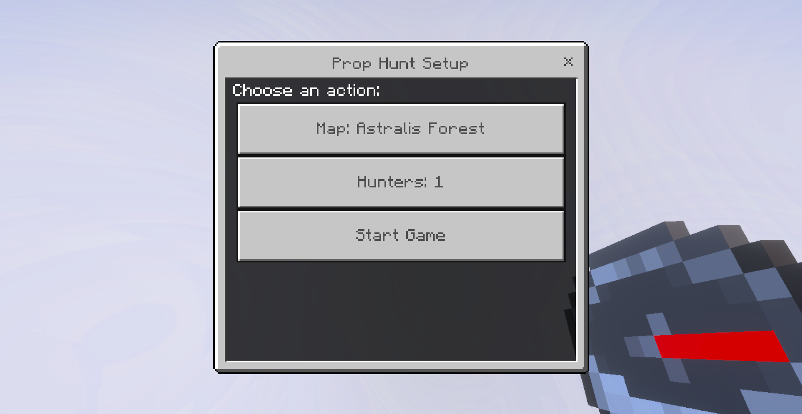
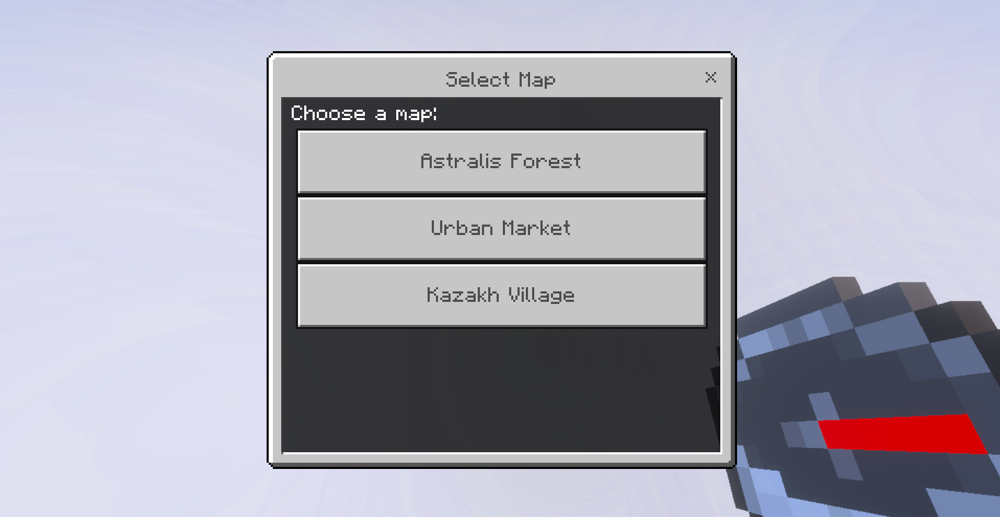
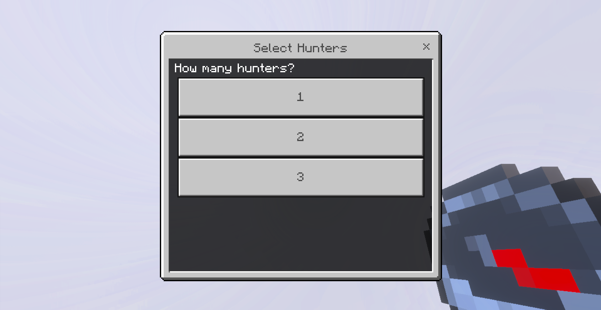

@"
# Prop Hunt: Astralis

A fully script-driven Prop Hunt minigame built for **Minecraft Bedrock Edition**, coded entirely in TypeScript using the official Minecraft Script API.

This project demonstrates advanced skills in game logic, UI systems, player management, and modular scripting. It features an admin-controlled setup interface, dynamic role system, and support for multiple maps. Ideal for showcasing Minecraft Bedrock scripting abilities.

---

## Core Features

- Admin-controlled game setup UI using `@minecraft/server-ui`
- Dynamic selection of maps and number of hunters
- Automatic teleportation of players
- Role distribution: Hunters and Hiders
- First joined player becomes admin and receives Compass UI
- All logic written in TypeScript and compiled into behavior packs

---

## How It Works

When players join the world:
- The **first player becomes the world owner** and receives a special **admin compass**
- Other players are automatically teleported to the lobby
- The admin can open a menu to configure map, number of hunters, and start the match

### Player Initialization

```
system.runInterval(() => {
  for (const player of world.getPlayers()) {
    if (!teleportedPlayers.has(player.name)) {
      teleportedPlayers.add(player.name);
      if (!ownerName) {
        ownerName = player.name;
        world.sendMessage(\`[Server] \${ownerName} is set as the world owner.\`);
        giveAdminCompass(player);
      } else {
        player.teleport(LOBBY_POS);
      }
    }
  }
});
```

---

### Admin Compass UI

```
function openAdminUI(player: Player) {
  new ActionFormData()
    .title("Prop Hunt Setup")
    .body("Choose an action!")
    .button(\`Map: \${maps[selectedMapIndex].name}\`)
    .button(\`Hunters: \${selectedHunters}\`)
    .button("Start Game")
    .show(player).then(res => {
      // handle selection
    });
}
```

Admin uses compass to:
- Choose from 3 maps:
  - Astralis Forest
  - Urban Market
  - Kazakh Village
- Set number of hunters: 1, 2, or 3
- Launch the game when ready

---

## UI Screenshots

### Title Screen


### Admin Compass Setup UI


### Map Selection Menu


### Hunter Count Selection


---

## Project Structure

```
PropHunt/
├─ behavior_packs/
├─ resource_packs/
├─ scripts/
│  └─ main.ts             // Main logic file
├─ dist/                  // Compiled output
├─ docs/
│  └─ images/             // UI screenshots
├─ .gitignore
├─ package.json
├─ tsconfig.json
```

---

## About the Author

This mod was created by **@danifeyrus** as part of a Minecraft scripting portfolio.

It showcases:
- UI design in Minecraft using TypeScript
- Modular and scalable script structure
- Real-time player management
- Custom logic implementation without external tools

